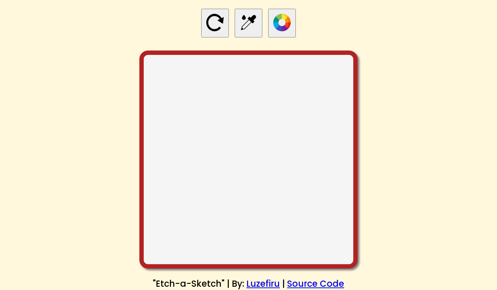

# odin-etch-a-sketch
A browser-based sketchpad according to The Odin Project's specifications utilizing JavaScript DOM Manipulation & Event Handlers.

I learned how to programmatically use Document Object Manipulation to add elements to my DOM Tree with specific parameters, saving a lot of time. Furthermore, I used the 'mousemove' Event to manipulate the sketch area's grid to change the colors imitating a pen-like experience.

The biggest improvement I noticed was the cleanliness of my code thanks to the <a href="https://getbem.com/introduction/">Block, Element, Modifier (BEM) CSS Style Guide</a>. It allowed me to semantically label my CSS classes so that I don't have to keep checking the HTML document for relationships between elements whether it's a child of a specific block section of the web page.

Other than that, I continued relying on Google Font Family ``@import url()``s to get access to more aesthetically-pleasing fonts. I also used the ``box-shadow`` CSS Property to add that "secret spice" to my Sketch Area. This is a property I'm planning to use frequently after this project.

I need to improve on:
- understanding what parameters are being passed into ``addEventListener`` and ``removeEventListener``
- knowing when to use IIFEs versus generic ``function () {}`` declarations
- making my project fit into a viewport consistently without introducing a scroll bar, but while also being responsive when minimizing the browser window

# Output
### [Visit the Website Here](https://luzefiru.github.io/odin-etch-a-sketch/)

# Requirements
These were the requirements in The Odin Project's [Project: Etch-A-Sketch](https://www.theodinproject.com/lessons/foundations-etch-a-sketch) site to serve as a guide for functionality. Other aesthetic choices and implementations solely depend on the programmer.
